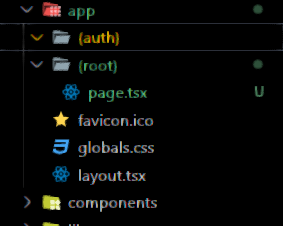

# les etapes de l'installation
## 1. next
```
pnpx create-next-app@latest 
```
puis suivre le prompt
## 2. shadcn ui
```
pnpm dlx shadcn-ui@latest init
```
puis suivre le prompt

## 3. configurer globals.css 
(voir le code )
## 4. configurer tailwind (tailwind.config.ts) et uploadthing pour l'upload file
- uploadthing : upload file for nextjs easily
https://uploadthing.com/
command line 
```
pnpm add uploadthing @uploadthing/react
```

- tailwind.config.ts
(voir le code ) et les commandes sont:

> tailwind.config.ts
```
import { withUt } from "uploadthing/tw";
 
export default withUt({
  // Your existing Tailwind config
  content: ["./src/**/*.{ts,tsx,mdx}"],
  ...
});
```

## 5- routes && file structure



## 6- Header

#### a- cree un compte clerk sur leur site
- copier les variables d'environnement dans
> .env.local
```
NEXT_PUBLIC_CLERK_PUBLISHABLE_KEY=[votre clé]
CLERK_SECRET_KEY=[votre clé]
```
#### b- install clerk
```
pnpm add @clerk/nextjs
```

#### c- wrap ton app avec le <ClerkProvider>
> app\(root)\layout.tsx
```
import { ClerkProvider } from '@clerk/nextjs'
import './globals.css'
 
export default function RootLayout({
  children,
}: {
  children: React.ReactNode
}) {
  return (
    <ClerkProvider>
      <html lang="en">
        <body>{children}</body>
      </html>
    </ClerkProvider>
  )
}
```

#### d- le middleware 

> app/middleware.ts
```
import { authMiddleware } from "@clerk/nextjs";
 
// This example protects all routes including api/trpc routes
// Please edit this to allow other routes to be public as needed.
// See https://clerk.com/docs/references/nextjs/auth-middleware for more information about configuring your Middleware
export default authMiddleware({});
 
export const config = {
  matcher: ["/((?!.+\\.[\\w]+$|_next).*)", "/", "/(api|trpc)(.*)"],
};


```

quand on se connecte sur localhost:3000, on est redirige vers /sign-in maintenant

## 6 - suite header
- ajouter le bouton <SignedOut> de clerk
- on cree app/(auth)/sign-in/[[...sign-in]]/page.tsx

> app/(auth)/sign-in/[[...sign-in]]/page.tsx
```
import { SignIn } from "@clerk/nextjs";

export default function Page() {
  return <SignIn />
}
```

- on cree app\(auth)\sign-up\[[...sign-up]]\page.tsx

> app/(auth)/sign-up/[[...sign-up]]/page.tsx
```
import { SignUp } from "@clerk/nextjs";

export default function Page() {
  return <SignUp />
}```


## le tuto
https://www.youtube.com/watch?v=zgGhzuBZOQg
https://github.com/adrianhajdin/event_platform


### variables d'environnement
```
#NEXT
NEXT_PUBLIC_SERVER_URL=

#CLERK
NEXT_PUBLIC_CLERK_PUBLISHABLE_KEY=
CLERK_SECRET_KEY=
NEXT_CLERK_WEBHOOK_SECRET=

NEXT_PUBLIC_CLERK_SIGN_IN_URL=/sign-in
NEXT_PUBLIC_CLERK_SIGN_UP_URL=/sign-up
NEXT_PUBLIC_CLERK_AFTER_SIGN_IN_URL=/
NEXT_PUBLIC_CLERK_AFTER_SIGN_UP_URL=/

#MONGODB
MONGODB_URI=

#UPLOADTHING
UPLOADTHING_SECRET=
UPLOADTHING_APP_ID=

#STRIPE
STRIPE_SECRET_KEY=
STRIPE_WEBHOOK_SECRET=
NEXT_PUBLIC_STRIPE_PUBLISHABLE_KEY=

```